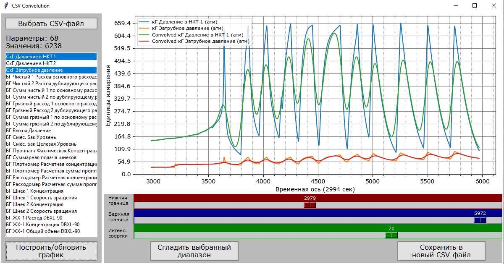

# Graph Convolution

<a name="readme-top"></a>

<!-- PROJECT LOGO -->
<br />
<div align="center">
  <a href="https://github.com/lostie21yo/graph-convolution">
    
  </a>
</div>

<!-- TABLE OF CONTENTS -->
<details>
  <summary>Table of Contents</summary>
  <ol>
    <li>
      <a href="#about-the-project">About The Project</a>
      <ul>
        <li><a href="#built-with">Built With</a></li>
      </ul>
    </li>
    <li>
      <a href="#getting-started">Getting Started</a>
      <ul>
        <li><a href="#installation">Installation</a></li>
      </ul>
    </li>
    <li><a href="#usage">Usage</a></li>
    <li><a href="#contact">Contact</a></li>
  </ol>
</details>


<!-- ABOUT THE PROJECT -->
## About The Project

Graph Convolution is a desktop program which designed to convolve determined data from CSV, TXT. 

Input:  CSV/TXT-file (2 service lines, no indexes)

Output: modified CSV/TXT-file (2 service lines, no indexes)

<p align="right">(<a href="#readme-top">back to top</a>)</p>


### Built With

* Python 3.10.7
* tkinter
* matplotlib
* numpy
* pandas

<p align="right">(<a href="#readme-top">back to top</a>)</p>


<!-- GETTING STARTED -->
## Getting Started

<!-- ### Prerequisites -->

### Installation

1. Clone the repo
   ```sh
   git clone https://github.com/lostie21yo/graph-convolution
   ```
2. Use executable file .exe or run .py file

<p align="right">(<a href="#readme-top">back to top</a>)</p>


<!-- USAGE EXAMPLES -->
## Usage

1. Select attached CSV/TXT file (2 service lines, no indexes)
2. Select one or more parametres
3. Set the range of data
4. Set the convolution coefficient
5. Press "Сгладить выбранный диапазон" button
6. After completion of work press "Сохранить в новый файл" button to save changes

<div align="center">
    
</div>

<p align="right">(<a href="#readme-top">back to top</a>)</p>


<!-- CONTACT -->
## Contact

Your Name - [Telegram](https://t.me/leoncox) - leon.coxsw@gmail.com

Project Link: [Manga-Slicer](https://github.com/lostie21yo/graph-convolution)

<p align="right">(<a href="#readme-top">back to top</a>)</p>


© 2023 GitHub, Inc.

